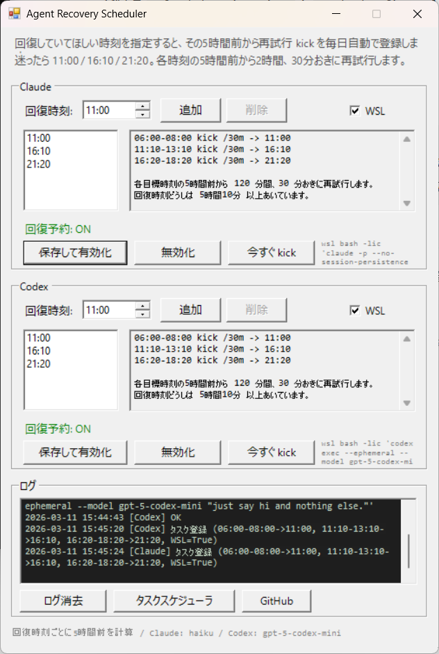

# Agent Recovery Scheduler

GitHub: <https://github.com/t-suzuki/agent-recovery-scheduler>

**Claude Code** と **Codex CLI** の 5 時間ローリングウィンドウに対して、**`何時ごろ回復していてほしいか`** を指定して管理するツールです。

Windows タスクスケジューラに軽い kick を登録し、指定した回復時刻の **5 時間前から** 自動で再試行します。

## 何がうれしい？

このツールは、**自分が困りやすい時間帯に合わせて回復を先回りする**ためのものです。

例:

- `16:10` に回復していてほしい -> `11:10` から `13:10` まで 30 分おきに kick
- `21:20` に回復していてほしい -> `16:20` から `18:20` まで 30 分おきに kick

朝から全力で回す人なら昼前の回復が助かるかもしれません。  
午前は軽めで午後に備えたい人なら、夕方前の回復が助かるかもしれません。

**いつ回復していると自分が助かるか**を先に決めて、それに合わせて kick を組み立てます。

## 特徴

- **回復時刻ベース** の設定
- **Claude / Codex 独立制御**
- **Windows タスクスケジューラ連携**
- **WSL 対応**
- **最小モデル** を使った軽量 kick
- **セッション蓄積防止**  
  Claude は `--no-session-persistence`、Codex は `--ephemeral`
- ログビューア付き
- 単一 `.ps1` ファイル、インストール不要

## スクリーンショット



## 動作要件

| 要件 | 備考 |
|---|---|
| Windows 10 / 11 | タスクスケジューラ + PowerShell 5.1 |
| Claude Code CLI | `claude` が Windows または WSL の PATH にあり認証済み（任意） |
| Codex CLI | `codex` が Windows または WSL の PATH にあり認証済み（任意） |
| WSL（任意） | 「WSL」を使う場合のみ |

## クイックスタート

### 方法 A: ダブルクリック

1. このリポジトリをダウンロードまたは clone
2. **`launch.bat`** をダブルクリック
3. Claude / Codex ごとに **回復していてほしい時刻** を追加
4. **保存して有効化** をクリック

> **SmartScreen の警告が出た場合**: 初回実行時に「Windows によって PC が保護されました」と表示されることがあります。**詳細情報** -> **実行** をクリックしてください。`launch.bat` は内部で `powershell -ExecutionPolicy Bypass -File claude-timer-kick.ps1` を実行しているだけです。

### 方法 B: PowerShell

```powershell
powershell -ExecutionPolicy Bypass -File claude-timer-kick.ps1
```

## どう設定する？

おすすめは、まず **昼前 / 夕方 / 夜** のように 2 〜 3 個の回復時刻を置くことです。

例:

- `11:00`
- `16:10`
- `21:20`

この場合、登録される kick は:

- `06:00-08:00 kick /30m -> 11:00 recovery`
- `11:10-13:10 kick /30m -> 16:10 recovery`
- `16:20-18:20 kick /30m -> 21:20 recovery`

### どういう時刻を入れるといい？

- 朝からかなり使うなら、**昼前に 1 回回復**
- 午後も使うなら、**夕方前にも 1 回回復**
- 夜も触るなら、**夜の回復も追加**

このツールは厳密最適化より、**自分の作業リズムに合う回復タイミングを置く**ためのものです。

## 重要: 近すぎる回復時刻は両立しません

5 時間ローリングウィンドウの境界を踏みやすいので、**回復時刻どうしは 5 時間 10 分以上あける必要があります。**

例えば:

- `11:00` と `16:00` は近すぎます
- `11:00` と `16:10` は両立します

フォームではこの競合をその場で警告します。  
近すぎる時刻がある場合、タスク登録は行いません。

## 仕組み

1. ユーザーが **回復していてほしい時刻** を追加
2. ツールがその **5 時間前** を起点に、**30 分おきに 2 時間** の再試行 kick を計算
3. Windows スケジュールタスク (`AgentTimerKick-Claude` / `AgentTimerKick-Codex`) を日次トリガーで登録
4. 指定時刻になると次のコマンドを実行

Claude:

```bash
claude -p --no-session-persistence --model haiku "just say hi and nothing else."
```

Codex:

```bash
codex exec --ephemeral --model gpt-5-codex-mini "just say hi and nothing else."
```

WSL を使う場合は、これらを `wsl bash -lic ...` 経由で実行します。

## フォームの見方

- **回復時刻**  
  自分が助かる時刻を `HH:mm` で追加します
- **プレビュー**  
  `11:10-13:10 kick /30m -> 16:10` のように再試行ウィンドウを表示します
- **WSL**  
  CLI を WSL 内で実行する場合にチェックします
- **保存して有効化**  
  現在の回復時刻リストでタスクを登録し直します
- **今すぐ kick**  
  定期実行を待たずにその場で試せます

## 設定

設定は `data/config.json` に保存され、次回起動時に復元されます。

モデルやプロンプトを変えたい場合は、`claude-timer-kick.ps1` の先頭を編集してください。

```powershell
$Script:DefaultPrompt = "just say hi and nothing else."
$Script:ClaudeModel   = "haiku"
$Script:CodexModel    = "gpt-5-codex-mini"
```

変更後は **保存して有効化** を押すと反映されます。

## アンインストール

1. `launch.bat` で GUI を起動
2. Claude / Codex の **無効化** をクリック
3. リポジトリフォルダごと削除

無効化せずにフォルダを削除すると、タスクスケジューラにタスクが残ります。  
その場合は `taskschd.msc` を開き、`AgentTimerKick-Claude` / `AgentTimerKick-Codex` を手動で削除してください。

## FAQ

**Q: このツールが志向している戦略は？**  
A: 常時一定間隔で回し続けることより、**回復していてほしい時刻を先に決めて、その近辺で回復を取りにいくこと**を重視しています。そのため、各目標時刻の5時間前から30分おきに2時間だけ再試行する方式を採っています。

**Q: 回復時刻はいくつ入れるべき？**  
A: まずは `11:00 / 16:10 / 21:20` のような 2 〜 3 個から始めるのがおすすめです。近すぎる時刻を増やしても両立しません。

**Q: なぜ 5 時間前に 1 回だけではなく再試行するの？**  
A: その時点でまだ前のウィンドウの中にいると、単発 kick は空振りになるからです。そこで、このツールは `5 時間前` から `30 分おきに 2 時間` 再試行して、前のウィンドウが終わった直後を取りこぼしにくくしています。

**Q: 指定した時刻に必ず回復する？**  
A: いいえ。外部の利用でいつウィンドウが始まったかは分からないので保証はできません。このツールは、**その時刻の近くで回復しやすくする**ために、可能になった直後を取りこぼしにくくするものです。

**Q: 土日も回ってしまうけど大丈夫？**  
A: このツールは曜日設定を持ちません。土日に使わないならそのままでも問題ない想定です。

**Q: `claude` / `codex` が PATH にない場合は？**  
A: まず **今すぐ kick** を押して試してください。失敗する場合は CLI のインストールと認証を確認してください。WSL の場合は WSL 側に CLI が必要です。

## ライセンス

MIT
